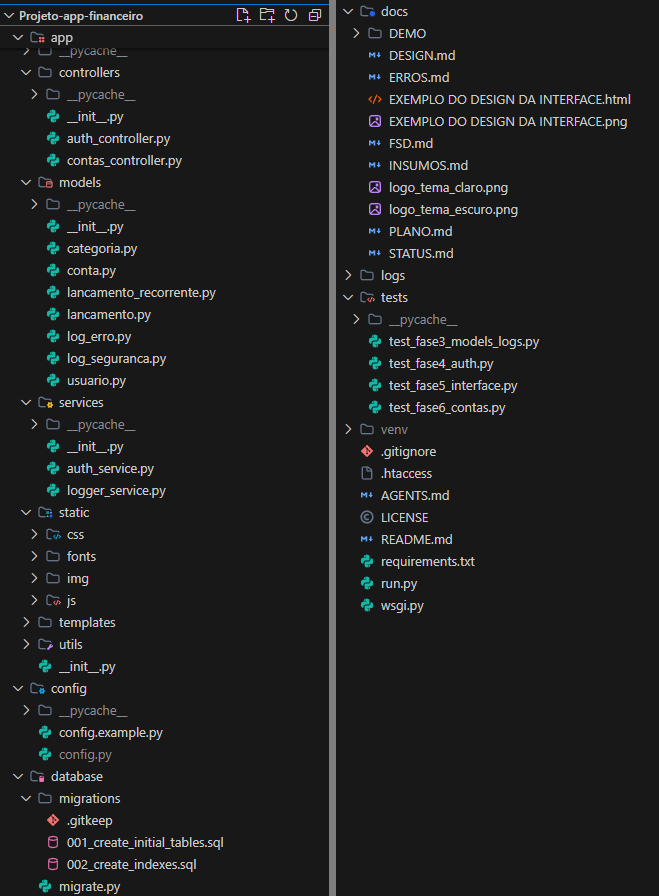
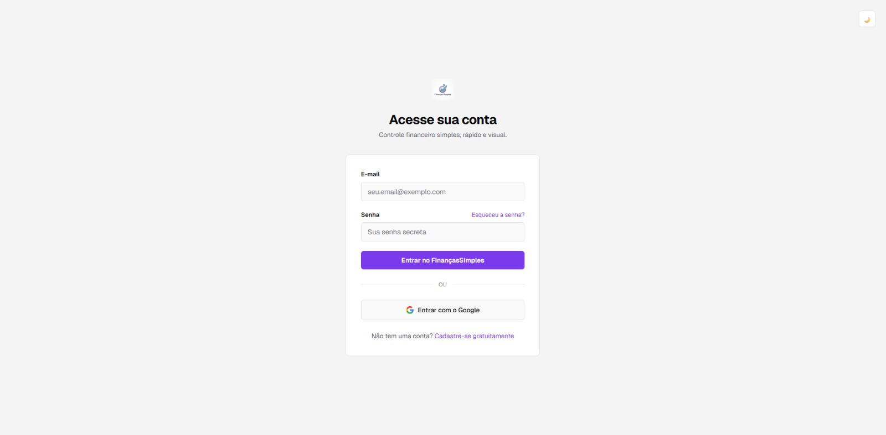
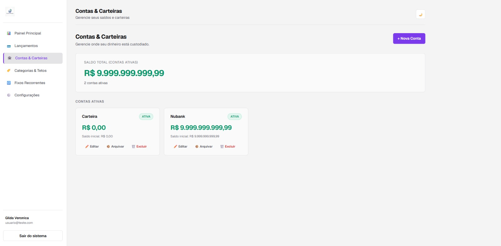
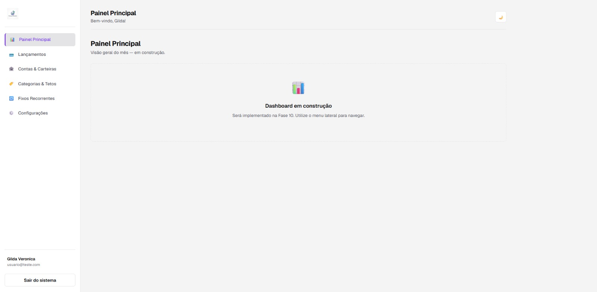

# 💰 FinançasSimples — Controle Financeiro Pessoal

Aplicação web para controle financeiro pessoal: dashboard com indicadores em tempo real, lançamentos avulsos e recorrentes, múltiplas contas/carteiras, categorias com teto de orçamento e transferências internas.

> Projeto pessoal desenvolvido com arquitetura MVC bem definida, isolamento de dados por usuário e versionamento de banco via migrations.

---

## 🔭 Objetivos do projeto

O projeto foi iniciado com o intuito de aperfeiçoar as habilidades dos desenvolvedores. O foco são habilidades de desenvolvimento de software assistido por ferramentas de **inteligência artificial**, desenvolvimento colaborativo e adesão a fluxos de desenvolvimento que espelham **práticas reais do mercado de trabalho**.

Os colaboradores criaram e utilizaram agentes de IA com o **Google Gemini 3.5 Flash-Lite** no navegador para auxiliá-los inicialmente a arquitetar e tomar decisões sobre a natureza do projeto. Em seguida, utilizaram o **Google Antigravity**, com o modelo **Gemini 3.8 Flash**, para gerar toda a estrutura e o código do sistema. O agente também foi utilizado para rodar testes, sugerir decisões técnicas e corrigir inconformidades. Os desenvolvedores ficaram responsáveis apenas pela operação da IA, pela validação entre o que estava planejado inicialmente e o que estava sendo desenvolvido na prática, e pelo versionamento do código.

---

## 🚀 Tecnologias

| Categoria | Tecnologia |
|---|---|
| Linguagem (backend) | Python |
| Framework backend | Flask (Blueprints + Application Factory) |
| Banco de dados | MySQL |
| Versionamento de schema | Migrations versionadas (`database/migrations/`) |
| Frontend | HTML5, CSS3, JavaScript (ES6+), React |
| Autenticação | E-mail/senha (hash com `werkzeug.security`/`bcrypt`) + Google OAuth 2.0 |
| Segurança | Sessão via cookies HTTP-only, proteção CSRF, isolamento por `usuario_id` |
| Deploy | PythonAnywhere (WSGI) |

---

## 🏗️ Arquitetura e decisões técnicas

- **MVC adaptado**: separação clara entre `Models`, `Controllers` e `Views`, com toda comunicação de dados padronizada sob o prefixo `/api/*`.
- **Migrations controladas**: schema MySQL criado e atualizado exclusivamente via migrations versionadas, executadas por linha de comando — sem rotas públicas de alteração de banco.
- **Isolamento absoluto por usuário**: todas as rotas e consultas aplicam o predicado `usuario_id = current_user.id`, bloqueando qualquer acesso cruzado entre contas.
- **Sem `.env`**: configurações e credenciais centralizadas em `config/config.py`, mantendo o padrão definido no FSD do projeto.
- **Autenticação híbrida**: cadastro tradicional ou login via Google, com provisionamento automático de categorias padrão e carteira inicial no primeiro acesso.
- **Design system dedicado**: identidade visual *High-Contrast Dark* (Obsidian) documentada separadamente em `docs/DESIGN.md`, com suporte a tema claro mantendo os mesmos acentos funcionais.

---

## 📦 Domínio da aplicação

- **Contas/Carteiras** — múltiplas contas com saldo calculado em tempo real
- **Categorias** — receita/despesa, com teto de orçamento mensal opcional
- **Lançamentos** — avulsos ou recorrentes, com status `pago`/`pendente`
- **Transferências** — movimentação entre contas próprias, sem impactar receitas/despesas
- **Dashboard** — saldo do mês, gráfico de despesas por categoria e alertas de vencimento

---

## 🗺️ Status do projeto

- [x] Documento de definição do sistema (PRD)
- [x] Documento de Especificação Funcional (FSD) e guia de design finalizados
- [x] Modelagem do banco (migrations)
- [x] Módulo de Autenticação (tradicional + Google OAuth)
- [x] Módulo de Contas/Carteiras
- [x] Módulo de Categorias e Orçamentos
- [ ] Módulo de Lançamentos (avulsos, transferências, recorrentes)
- [ ] Dashboard com indicadores e gráficos
- [ ] Testes e validação de segurança (IDOR, força bruta)
- [ ] Deploy em produção (PythonAnywhere)

---

## 📸 Demonstrações do projeto

### 📂 Estrutura de diretórios

### ⚪ Tela de Login

### ⚪ Tela de Carteiras

### ⚪ Tela dashboard pendente

---

## 👤 Sobre os desenvolvedores

### Arthur Cosmo
Desenvolvedor com base sólida em **Java | SpringBoot**, atualmente aprofundando conhecimento em arquitetura de APIs, boas práticas de backend e, neste projeto, adquiririndo valiosos conhecimentos e experência prática de desenvolvimento colaborativo com **inteligência artificial**. Explorando também Python/Flask e React fora da stack principal, fortalecendo suas noções de arquitetura de software.

📍 Recife, PE — em busca de oportunidade como desenvolvedor júnior.

### Glauber Oliveira

Desenvolvedor com foco em **Python | FastAPI**, unindo isso a conhecimentos em **HTML | CSS** para a construção de interfaces. Atualmente aprofundando estudos em **Django e Flask**, ampliando a visão sobre diferentes abordagens de desenvolvimento backend em Python. Neste projeto, também vem ganhando experiência prática de desenvolvimento colaborativo com **inteligência artificial** e explorando **React**, o que tem ampliado sua visão sobre arquitetura de software.

📍 Recife, PE — em busca de oportunidade como desenvolvedor júnior.